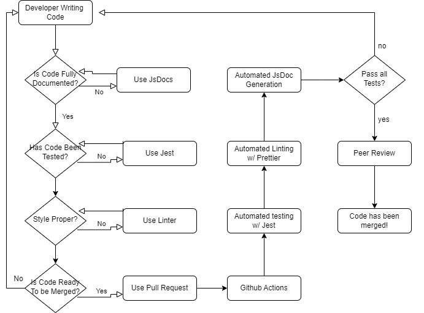

# Diagram

# What we've done so far...

Our goal for the phase 1 pipeline is to create a system to automate tasks such as building, testing, documentation, and code quality. This will be a massive boost to our developers because it allows us to run automated tasks on pushes/merges, and give developers and reviewers feedback instantaneously. It will also offer documentation to developers that they can access quickly. Here is our current progress.

## JsDocs--Documentation

### Completed

JsDocs allows developers annotate JavaScript files in a easier and cleanner manner. Features such as auto documentation, comment template generator, and html converter makes this tool very valuable for our group, which is why we decided to use it for our project.
JsDocs is fully functional for the team to use. All members need to do is to download Node.js (https://nodejs.org/en/download) and in their terminal of VS Code write 'npm install -g jsdoc'. Afterwards, JsDocs is fully functional.
We tested JsDocs by creating a separate branch with a source and a test files. The source incldues a function to add two numbers. The test file checks if the function works appropriately. Finally, we ensured that a fully documented HTML file is created by typing the command 'jsdoc <nameOfFile.js>. JsDocs now also works for the rest of the project.

### In Progress

Currently working on automatically generating this document on push, such that each branch has an embedded html file that can be opened to view documentation.

## Codeclimate--code quality via tool, linting

### Completed

Code climate has been set up for the repository, and is activated on code push. It has ESLint enabled which checks for basic linting. Code climate additionally offers further insight through their dev portal where we can view issues regarding test coverage, function usage, and many other metrics that add up together to code quality. Whenever a PR is opened, code climate additionally runs its own checks and updates status on the PR, allowing devs and reviewers to see if there are any basic code issues from github itself.

## Jest--Unit Testing and Linting

### Completed

We have set up a github actions workflow that automatically runs all Jest test files within the source folder. From here we can add tests that are as small as unit tests, up to full end to end tests and pixel tests for our canvas. This would allow us to check our code for functionality after development, and also ensure backwards compatibility with new code as the workflow checks if previous tests have been broken by new code. Any issues that arise during the github action workflow will be shown after a push or PR, allowing developers and reviewers to see if there are any testing issues arising from new changes.

## Pull Request--Code quality via human review

### Completed

We have set up branch protection rules on our main branch that prevent other branches from being merged in without at least 1 review. As such after a developer has finished their work and opens a PR they must have their code reviewed by at least one other reviewer. From there they can review it to approve or ask for more changes. After it is approved by all reviewers (at least 1) devs may merge the pull request.

## Prettier--Code Styling

### Completed

We have set up a github actions workflow that automatically runs the prettier check to ensure style guidelines have been enforced. This allows for our code to have standardized patterns in the repository, and as such we wont run into style based merge conflicts.

### In Progress

Since we have an active sprint going, and the Prettier template was not decided on before, we are holding off on adding prettier to main until the end of the sprint. Once the sprint is complete we will merge it into main, while also doing a large refactoring commit that essentially aligns all of our files to the prettier format. This is to prevent killing our active branches by changing all of the files in main branch.
