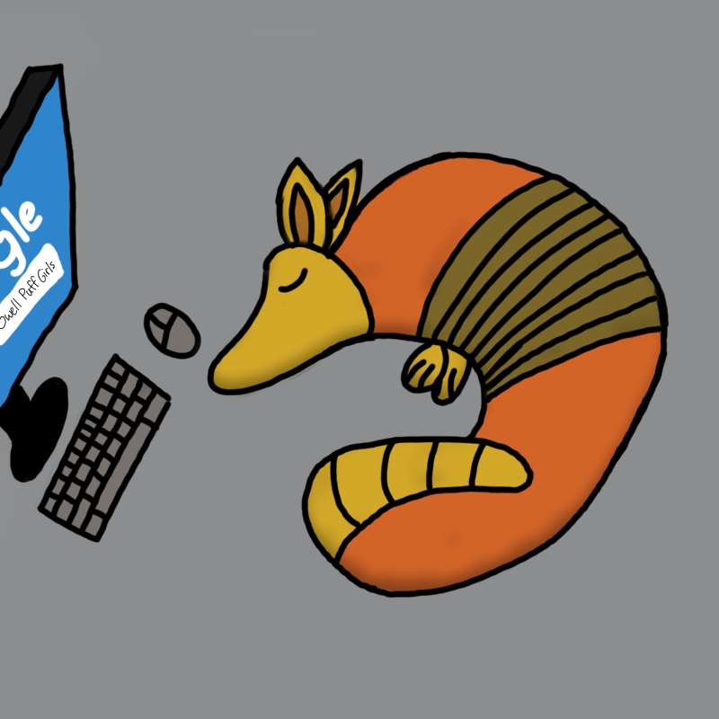

# Team Amiable Armidillos

**Team color:**  
Orange  

**Team logo:**  

**Team Value**  
Our team values:

- Communication: we aim for every team member to communicate clearly and be respectful to each other.
- Collaboration: we will be willing to help each other to achieve team's goals.
- Trust: we are building a team where we can trust each other to do their jobs and with integrity.
- Accountability: each team member would take ownership of their responsibilities and be accountable for their actions and decisions. This includes admitting mistakes and taking steps to correct them.
- Open-mindedness: we want to be able to give constructive feedback, be open to other's opinion, and learn from our mistakes.

## Roster

**Victor Ku**

> Victor is a co-lead for the Amiable Armadillos. He is a second year Comptuer Engineering major at Warren and has a plethora of experience programming in Java, Python, and C++. Victor also led his executive team to found 3D Sprouts, a nonprofit dedicated to 3D print face shields during the pandemic and make 3D printing more accessible across the United States.  

Link to his GitHub: [VictorKuu](https://github.com/VictorKuu?tab=repositories)

**Chi Wong**

> Chi is a co-lead for the team. He is a fourth year Data Science major at Marshall. He is also a research assistant under Cog Sci department and a software engineer intern. Chi has experience constructing and the leading development of various web application projects, his usual tech stack is Typescript with React and Firebase.

Github: [ChiSengWong](https://github.com/ChiSengWong)

**Aiden Chen**

> Aiden is a planner of the team. He is third year Computer Science major at Seventh College and has some experience with HTML, CSS and React.

Github: [sorata000x](https://github.com/sorata000x)

**Khushi Patel**

> Khushi is a developer for the team. She is a second year Computer Science major at Sixth College at UC San Diego, and has experience programming in Java, Python, C++, HTML, CSS and React.

Github: [khushijpatel](https://github.com/khushijpatel)

**Jerry Gong**

> Jerry is a developer for the team. He is a second year CS and stats major at Muir college at UCSD and has experience with HTML, CSS, Javascript, Java, and Python.

Github: [JGong7](https://github.com/JGong7)

**Cheng Qian**

> Cheng is a developer for the team. He is a third year Computer Science major at UCSD and has programming experience mainly with C++, Python and Java.

Github: [Chengqianc](https://github.com/Chengqianc)

**Shashank Venkatramani**

> Shashank Venkatramani is a developer for the team. He is a second year Computer Science major at UCSD and has experience with python, C, and Java.

Github: [ShashankVenkatramani](https://github.com/ShashankVenkatramani)

**Andy Fang**

> Andy Fang is a designer for the team. He is a third year Math-Computer Science major at UCSD with some experience with python, C, C++, and Java.

Github: [A4Fang](https://github.com/A4Fang)

**Pramodya Rajapakse**

> Pramodya is a developer for the team. He is a third year Computer Science major at Warren College at UCSD, and has experience with Java, C, C++, and Python.

Github: [pramodya-rajapakse](https://github.com/pramodya-rajapakse)
