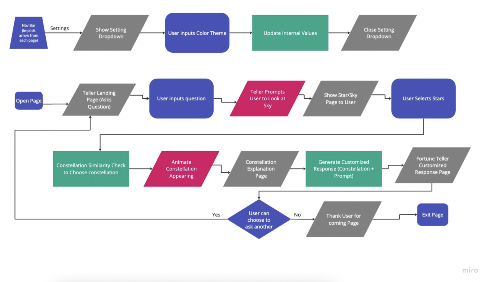
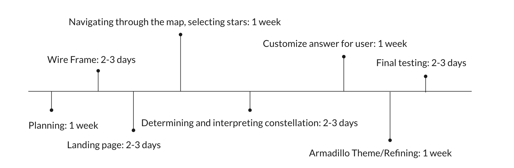

# App Pitch - Stargazer

## Statement of Purpose / Problem

  The problem our application, Stargazer, wants to address is the universal human concern for the future, whether it is due to superstition or fear or optimism or plain curiosity for the future. Oftentimes, people seek guidance or clarity on their personal and professional life but lack the willingness to share their feelings and concerns to people in-person, thus seeking personal spiritualistic avenues online. Our application intends to be a outlet for users to have their burning questions about the the future answered by incorporating astrological signs and star predictions. 

## Solution

  The user, upon entering our web application, is prompted by the teller to ask a question about their future. The teller then takes them on a guided experience, where they search the night sky full of stars, and select stars that call out to them. Upon selecting the stars they resonate most with, a constellation matching those stars slowly emerge, as the teller details the mythology and meaning behind their chosen sign. The teller wraps up by giving advice on their original question based off of the chosen sign.

## Diagrams

### Top Level Diagram

### Wireframe Models

## Appetite (Timeline)

## Risks and Rabbit Holes

- We should focus on our core features and the user experience first, and then expand to other functions/features. An abundance of features, despite how cool or useful, will be overwhelming to the user and overcomplicate their experience
- We may need to use new and unfamiliar tools for both the front and backend development, such as CSS animations, and potenatially new APIs (although we will try to mitigate this by using built-in APIs as much as possible)
- Having a goal that’s either too specific, to the point that it leaves no room for adaptability, or under-specified, to the point that we are unsure of what we are working towards
- Ensuring everyone is on the same page in terms of what the end user experience should be like, and where we are in terms of development
- Not maintaining quality documentation, as that will make development/adaption more difficult, especially when it comes to unfamiliar tools

## Similar Apps and Competition

- We have competition in the form of other tarot card, fortune predictors, and palm readers online, as well as star viewers/online planetariums
- More classical online fortune predictors have the advantage of following established ceremonies/rituals and therefore have the advantage of familiarity
- Star viewers and online planetariums are very accurate to the real world, and designed for astronomy enthusiasts
- Our app is unique in being at the intersection of fortune telling and astronomy, and we are poised to offer a unique experience in the world of astrology and star predictions

## No-Gos

- The Ability share/post your results with friends
- Focusing too much on the UI/UX of the web application
- Making the web application secure
- Too many steps/instructions to the ceremony/ritual process
- The ability to upload images
- The ability to save the user's previous results
- Don’t focus on real animation–mainly use css
- Creating real animations (we will stick to CSS)
- User authentication

## User Personas

### Persona 1: Jacob

Jacob is a middle-aged man who just lost his job and is desperate. He has been questioning his career path and the professional choices he has made so far. Jacob feels like the work he's been doing for the past several years isn’t fulfilling anymore and that life was meant for more. However, he is unsure if leaving his career is a safe move.  
Jacob is trying to figure out his next step in life, whether that be finding a new job in the same career or taking a dive into a different career, hopefully more fulfilling career.  
He has a lot of corporate experience, has been programming for nearly a decade, is fairly comfortable around technology, and professional in the workplace but usually very reserved.

### Persona 2: Jawn

Jawn is a high school student who usually breezes through school like it is nothing. He often finds himself with nothing to do after school, and has been searching for some sort of entertainment. 
Jawn is seeking a prediction about his future for entertainment purposes and perhaps to have a funny story to tell his friends at school.
He is currently pursuing a high-school education, athlete, fairly good social skills, and grew up using technology.

### Persona 3: Tammy

Tammy is a devoutly religious woman in her early 40s and has been a devout follower of her faith since childhood. Tammy is a kind and caring person, who is always willing to help others in need. Every day she checks on horoscopes and readings to see how the day and the rest of her week will go, as well as signs about the future.  
Tammy's faith plays a central role in her life and influences all of her decisions. Tammy believes that by living a good and virtuous life, she can bring honor to her faith and be a positive influence on those around her.  
Recently, her connection with God has been faltering and isn’t able to clearly converse anymore. She is desperately looking for ways to reconnect, and thus has begun using stars and constellations as her guide.
